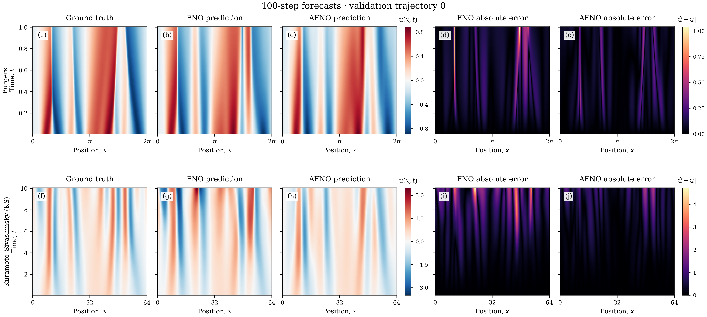

# AFNO: Burgers and KS

A compact, standalone research project for **Autoregression-Free Neural Operators (AFNO)** on two time-dependent PDEs: viscous Burgers and Kuramoto–Sivashinsky (KS). It includes AFNO and FNO implementations, pretrained weights, small runnable examples, the training curriculum, and publication-quality figures.



This is an independent implementation inspired by [Autoregression-Free Neural Operators for Time-Dependent PDEs](https://arxiv.org/abs/2605.25413v3). The balanced curriculum is our additional training recipe. This repository is not the paper authors' official code or a claim to reproduce all of their results.

## Quick start

Use Python 3.10 or newer. From this folder:

```bash
python -m venv .venv
source .venv/bin/activate
python -m pip install -e .
python -m afno verify
python -m afno demo --equation both --output outputs/demo
```

On Windows, activate with `.venv\Scripts\Activate.ps1` in PowerShell. Demos run on CPU by default. A CUDA-enabled PyTorch installation can use `--device cuda`.

The demo loads the four included checkpoints, predicts 100 steps for validation trajectory 0 of each PDE, and saves prediction arrays, MSEs, and PNG/PDF comparisons. It uses only files in this project. The bundled weights contain model tensors and basic metadata; no training optimizer states or original workstation paths are needed.

To recreate the main figures directly from saved predictions, including the error curves averaged over all 100 validation trajectories:

```bash
python -m afno figures --output outputs/figures
```

The ready-to-use [figures](figures/README.md) show **Ground truth / Prediction / Absolute error**, with FNO and AFNO as rows. The combined figure puts both PDEs together. Labels use **AFNO** throughout.

## Included results

MSE averaged over 100 validation trajectories, with evolution at 256 spatial points and readouts interpolated to the 1024-point reference grid:

| PDE | Model | First-five MSE | Full-100 MSE |
| --- | --- | ---: | ---: |
| Burgers | FNO | 4.79039e-4 | 2.85521e-2 |
| Burgers | AFNO | **3.64943e-4** | **1.30393e-2** |
| KS | FNO | 3.86702e-4 | 2.60094e-1 |
| KS | AFNO | **2.74843e-4** | **1.19973e-1** |


## Train from scratch

First check the complete training pipeline with small CPU examples:

```bash
python -m afno smoke --equation burgers --output outputs/smoke_burgers
python -m afno smoke --equation ks --output outputs/smoke_ks
```

Then run either full example, normally on a GPU:

```bash
python -m afno train --equation burgers --output runs/burgers --device cuda
python -m afno train --equation ks --output runs/ks --device cuda
```

Each command generates deterministic training and validation trajectories, trains FNO and AFNO from scratch, applies AFNO's curriculum and balanced stages, and evaluates both models. Full data generation uses about 435 MiB per PDE, plus checkpoints and outputs. The complete 500 + 60 + 40 epoch recipe is substantially more expensive than the small demo.

Resume an interrupted run with the same command plus `--resume`. The original schedules are retained; changed code, recipes, data or completed checkpoint hashes are rejected. To experiment with different settings, use a new output directory and custom JSON recipes:

```bash
python -m afno train --equation burgers --config my_burgers.json \
  --warmup-config my_warmup.json --balanced-config my_balanced.json \
  --output runs/my_experiment --device cuda
```

Copy the bundled [Burgers](src/afno/assets/configs/burgers.json), [KS](src/afno/assets/configs/ks.json), [warmup](src/afno/assets/configs/warmup.json), and [balanced](src/afno/assets/configs/balanced.json) recipes to start. Training generates and reads `train` and `val` only. No test trajectories are distributed or evaluated by this workflow. A generic [Slurm example](scripts/train.slurm) is included for cluster users; Slurm is optional.

See [reproducibility and file formats](docs/REPRODUCIBILITY.md) for checkpoint locations, evaluation, source checks, and the difference between reproducing saved figures and retraining models.

## Project layout

```text
src/afno/
  models.py                   AFNO and FNO
  solvers.py, data.py          Burgers/KS solvers and datasets
  train.py                    Base training
  warmup.py, balanced.py       Curriculum and balanced training
  *_objectives.py              Training losses
  evaluation.py, workflow.py   Evaluation and complete workflow
  demo.py, figures.py          Pretrained examples and plotting
  assets/configs/              Full training recipes
  assets/pretrained/           Four compact model checkpoints
  assets/examples/             Two sample trajectories and population errors
figures/                      Ready-to-use PNG/PDF figures
tests/                        Numerical and workflow checks
docs/                         Methods and reproducibility notes
```

Run the tests after installation:

```bash
python -m unittest discover -s tests -v
```

The tests check latent Euler updates, loss gradients through step 100, interrupted training, data integrity, reference-grid evaluation, and bundled inference. See [verification](docs/VERIFICATION.md) for the checks performed on this release and [NOTICE](NOTICE.md) for attribution and license status.
